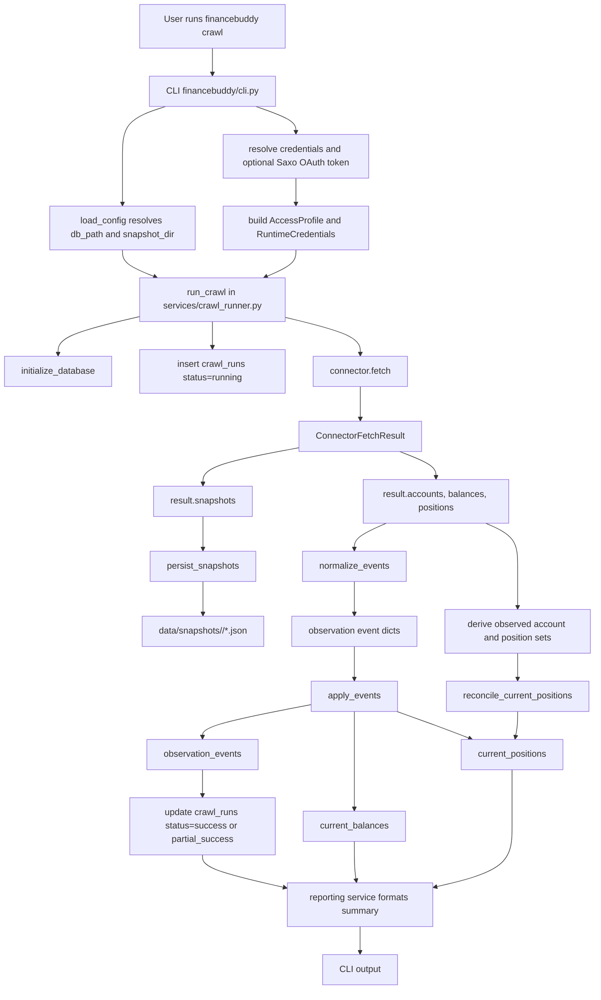

# High-Level Architecture

## Overview

FinanceBuddy is a local-first finance crawler and portfolio tracker.

The current implementation is intentionally narrow:
- one manual CLI entrypoint
- one demo connector and one Saxo connector path
- one local SQLite database
- raw JSON snapshot retention
- normalized observation events
- derived current-state projections

The core design is event-log-first. Connector output is not written directly into current-state tables. Instead, the system:

1. fetches raw source data
2. stores raw snapshots
3. normalizes observations into event records
4. derives current state from those events

This gives the project a clear path toward replay, auditing, and later historical analysis.

## Top-Level Components

### CLI

File: [financebuddy/cli.py](/Users/nico/Workspace/FinanceBuddy/financebuddy/cli.py)

The CLI is the only runtime entrypoint in this milestone.

Responsibilities:
- accept crawl inputs
- prompt for a password when needed
- resolve Saxo SIM access tokens through the local OAuth token store when needed
- build the access profile for the selected user
- invoke crawl orchestration
- print a simple summary

Current command:

```bash
uv run financebuddy crawl \
  --data-dir ./data \
  --fixture tests/fixtures/demo_bank/accounts.json \
  --username alice
```

### Configuration

File: [financebuddy/config.py](/Users/nico/Workspace/FinanceBuddy/financebuddy/config.py)

Configuration is intentionally small and filesystem-focused.

`load_config()` resolves:
- `data_dir`
- `db_path`
- `snapshot_dir`
- `base_currency`

### Connector Layer

Files:
- [financebuddy/connectors/base.py](/Users/nico/Workspace/FinanceBuddy/financebuddy/connectors/base.py)
- [financebuddy/connectors/demo_bank_api.py](/Users/nico/Workspace/FinanceBuddy/financebuddy/connectors/demo_bank_api.py)
- [financebuddy/connectors/saxo_bank_api.py](/Users/nico/Workspace/FinanceBuddy/financebuddy/connectors/saxo_bank_api.py)

The connector layer isolates institution-specific fetch logic from the rest of the system.

The base contract defines:
- `AccessProfile`
- `RuntimeCredentials`
- `Connector`

The current connectors:
- demo connector
  - loads fixture JSON from disk
  - maps source data into `AccountPayload`, `BalancePayload`, `PositionPayload`
  - returns a `ConnectorFetchResult`
  - preserves the original fixture payload as a `RawSnapshot`
- Saxo connector
  - supports fixture-backed crawls and SIM OpenAPI crawls
  - receives short-lived bearer access tokens from the CLI auth layer
  - fetches accounts, balances, and positions from Saxo-shaped endpoints
  - maps source data into the same normalized payload models
  - preserves each fetched response page as a `RawSnapshot`

### Saxo Authentication

Files:
- [financebuddy/auth/saxo_oauth.py](/Users/nico/Workspace/FinanceBuddy/financebuddy/auth/saxo_oauth.py)
- [financebuddy/auth/saxo_callback.py](/Users/nico/Workspace/FinanceBuddy/financebuddy/auth/saxo_callback.py)
- [financebuddy/auth/token_store.py](/Users/nico/Workspace/FinanceBuddy/financebuddy/auth/token_store.py)

Saxo SIM crawls use OAuth before connector fetch starts. The CLI resolves an
access token by first honoring `SAXO_ACCESS_TOKEN`, then refreshing a stored
Saxo refresh token, and finally starting an interactive PKCE login when allowed.

The connector does not receive app keys, refresh tokens, or OAuth state. It only
receives the short-lived bearer access token through `RuntimeCredentials`.

### Snapshot Persistence

File: [financebuddy/snapshots.py](/Users/nico/Workspace/FinanceBuddy/financebuddy/snapshots.py)

Raw snapshots are written to:

```text
<snapshot_dir>/<run_id>/<snapshot_name>.json
```

Current implementation details:
- JSON payload only, pretty-printed and sorted
- safe filename enforcement for `snapshot_name`

The stored file is meant to preserve source payloads for inspection and debugging.

### Ingestion

File: [financebuddy/ingestion.py](/Users/nico/Workspace/FinanceBuddy/financebuddy/ingestion.py)

The ingestion layer converts connector output into schema-shaped event dictionaries.

Current event types:
- `balance_observed`
- `position_observed`

Each event includes:
- `event_id`
- `run_id`
- `event_type`
- `canonical_account_key`
- `asset_key`
- `amount`
- `quantity`
- `currency`
- `observed_at`
- `payload_json`

Important behavior:
- missing `source_account_id` is rejected
- event payload JSON preserves the normalized source model

### Database and Schema

Files:
- [financebuddy/db.py](/Users/nico/Workspace/FinanceBuddy/financebuddy/db.py)
- [financebuddy/schema.py](/Users/nico/Workspace/FinanceBuddy/financebuddy/schema.py)

SQLite is the normalized local store.

Current tables:
- `crawl_runs`
- `observation_events`
- `current_balances`
- `current_positions`

`db.py` provides:
- `connect()`
- `transaction()`

`schema.py` ensures the milestone-one tables exist before use.

### Projections

File: [financebuddy/projections.py](/Users/nico/Workspace/FinanceBuddy/financebuddy/projections.py)

Projection code has two jobs:

1. append normalized events into `observation_events`
2. maintain derived current-state tables

Current projection behavior:
- balances upsert into `current_balances`
- positions upsert into `current_positions`
- unsupported event types fail fast
- older events do not overwrite newer projected state

The projection layer also reconciles brokerage positions that disappear from a later observed crawl, clearing stale rows for that account.

### Crawl Orchestration

File: [financebuddy/services/crawl_runner.py](/Users/nico/Workspace/FinanceBuddy/financebuddy/services/crawl_runner.py)

`run_crawl()` is the core orchestration function.

It performs:

1. database initialization
2. crawl-run start record creation
3. connector fetch
4. snapshot persistence
5. event normalization
6. projection updates
7. projection reconciliation for missing positions
8. crawl-run finalization

The crawl-run table tracks:
- `run_id`
- `profile_id`
- `connector_id`
- `status`
- `started_at`
- `finished_at`
- `warnings_json`

Important behavior:
- successful runs end as `success` or `partial_success`
- failed runs are recorded as `failed`
- final event/projection updates and crawl-run completion are transactionally aligned

### Reporting

File: [financebuddy/services/reporting.py](/Users/nico/Workspace/FinanceBuddy/financebuddy/services/reporting.py)

Reporting is intentionally simple in this milestone.

It formats:
- account lines
- balance lines
- position lines

This is only a CLI presentation layer; it does not own persistence or aggregation logic.

## Data Flow

The current end-to-end flow is:

1. User runs `financebuddy crawl`
2. CLI resolves paths, profile metadata, and credentials
3. Connector fetches source data
4. Raw snapshots are written to disk
5. Connector output is normalized into events
6. Events are inserted into the event log
7. Current-state tables are updated from those events
8. Crawl metadata is finalized
9. CLI prints a summary

### Mermaid Data Flow

This diagram follows the main runtime path in
[financebuddy/services/crawl_runner.py](/Users/nico/Workspace/FinanceBuddy/financebuddy/services/crawl_runner.py).



### Saxo End-to-End Example

The example below uses the current Saxo fixture shape and shows how one account
flows through the system. The exact `event_id`, `run_id`, `captured_at`, and
snapshot paths vary per crawl.

#### 1. Raw Saxo API responses

Account page:

```json
{
  "Data": [
    {
      "AccountKey": "ACC-001",
      "Name": "Saxo Global Account",
      "AccountType": "Cash",
      "Currency": "EUR"
    }
  ],
  "__next": "/port/v1/accounts?page=2"
}
```

Balance response for `ACC-001`:

```json
{
  "AccountKey": "ACC-001",
  "Data": [
    {
      "CashBalance": "1250.50",
      "Currency": "EUR",
      "LastUpdated": "2026-04-12T08:10:00Z"
    }
  ]
}
```

Position response excerpt:

```json
{
  "Data": [
    {
      "AccountKey": "ACC-001",
      "AssetType": "Stock",
      "Description": "Novo Nordisk B",
      "LastUpdated": "2026-04-12T08:15:00Z",
      "Quantity": "12.5",
      "Symbol": "NOVO-B",
      "Currency": "DKK",
      "Price": "987.40"
    }
  ]
}
```

Those responses are preserved as raw snapshots such as:

```text
data/snapshots/<run_id>/accounts.json
data/snapshots/<run_id>/balance_ACC-001.json
data/snapshots/<run_id>/positions.json
```

#### 2. Connector-normalized payloads

`financebuddy/connectors/saxo_bank_api.py` converts the raw responses into the
shared payload models used by the rest of the pipeline.

Account payload:

```json
{
  "source_account_id": "ACC-001",
  "display_name": "Saxo Global Account",
  "account_type": "brokerage",
  "currency": "EUR"
}
```

Balance payload:

```json
{
  "source_account_id": "ACC-001",
  "amount": "1250.50",
  "currency": "EUR",
  "observed_at": "2026-04-12T08:10:00+00:00"
}
```

Position payload:

```json
{
  "source_account_id": "ACC-001",
  "asset_symbol": "NOVO-B",
  "asset_name": "Novo Nordisk B",
  "quantity": "12.5",
  "unit_price": "987.40",
  "currency": "DKK",
  "observed_at": "2026-04-12T08:15:00+00:00"
}
```

The connector returns those lists inside one `ConnectorFetchResult`:

```json
{
  "accounts": [
    {
      "source_account_id": "ACC-001",
      "display_name": "Saxo Global Account",
      "account_type": "brokerage",
      "currency": "EUR"
    }
  ],
  "balances": [
    {
      "source_account_id": "ACC-001",
      "amount": "1250.50",
      "currency": "EUR",
      "observed_at": "2026-04-12T08:10:00+00:00"
    }
  ],
  "positions": [
    {
      "source_account_id": "ACC-001",
      "asset_symbol": "NOVO-B",
      "asset_name": "Novo Nordisk B",
      "quantity": "12.5",
      "unit_price": "987.40",
      "currency": "DKK",
      "observed_at": "2026-04-12T08:15:00+00:00"
    }
  ]
}
```

#### 3. Ingestion event payloads

`financebuddy/ingestion.py` turns balances and positions into normalized event
dictionaries. These are the payloads sent from ingestion to projection.

Balance event:

```json
{
  "event_id": "<uuid>",
  "run_id": "<run_id>",
  "event_type": "balance_observed",
  "canonical_account_key": "account:ACC-001",
  "asset_key": null,
  "amount": "1250.50",
  "quantity": null,
  "currency": "EUR",
  "observed_at": "2026-04-12T08:10:00+00:00",
  "payload_json": "{\"source_account_id\": \"ACC-001\", \"amount\": \"1250.50\", \"currency\": \"EUR\", \"observed_at\": \"2026-04-12T08:10:00Z\"}"
}
```

Position event:

```json
{
  "event_id": "<uuid>",
  "run_id": "<run_id>",
  "event_type": "position_observed",
  "canonical_account_key": "account:ACC-001",
  "asset_key": "asset:NOVO-B",
  "amount": "987.40",
  "quantity": "12.5",
  "currency": "DKK",
  "observed_at": "2026-04-12T08:15:00+00:00",
  "payload_json": "{\"source_account_id\": \"ACC-001\", \"asset_symbol\": \"NOVO-B\", \"asset_name\": \"Novo Nordisk B\", \"quantity\": \"12.5\", \"unit_price\": \"987.40\", \"currency\": \"DKK\", \"observed_at\": \"2026-04-12T08:15:00Z\"}"
}
```

Important details:
- `canonical_account_key` is derived as `account:<source_account_id>`
- `asset_key` is derived as `asset:<asset_symbol>` for positions
- `amount` means cash balance for balance events and unit price for position events
- `payload_json` stores the normalized connector payload, not the original Saxo response

#### 4. Projection writes

`financebuddy/projections.py` consumes those event dictionaries in two ways.

First, every event is appended to `observation_events`:

```json
{
  "event_id": "<uuid>",
  "run_id": "<run_id>",
  "event_type": "position_observed",
  "canonical_account_key": "account:ACC-001",
  "asset_key": "asset:NOVO-B",
  "amount": "987.40",
  "quantity": "12.5",
  "currency": "DKK",
  "observed_at": "2026-04-12T08:15:00+00:00",
  "payload_json": "{\"source_account_id\": \"ACC-001\", \"asset_symbol\": \"NOVO-B\", \"asset_name\": \"Novo Nordisk B\", \"quantity\": \"12.5\", \"unit_price\": \"987.40\", \"currency\": \"DKK\", \"observed_at\": \"2026-04-12T08:15:00Z\"}"
}
```

Then the current-state tables are upserted.

`current_balances` row:

```json
{
  "canonical_account_key": "account:ACC-001",
  "amount": "1250.50",
  "currency": "EUR",
  "observed_at": "2026-04-12T08:10:00+00:00"
}
```

`current_positions` row:

```json
{
  "canonical_account_key": "account:ACC-001",
  "asset_key": "asset:NOVO-B",
  "quantity": "12.5",
  "unit_price": "987.40",
  "currency": "DKK",
  "observed_at": "2026-04-12T08:15:00+00:00"
}
```

If a later brokerage crawl for `ACC-001` does not include `NOVO-B`,
`reconcile_current_positions()` deletes the stale `current_positions` row for
that account once the later observation timestamp is known.

## Persistence Model

### Raw Layer

Raw source payloads are kept as JSON snapshots.

Purpose:
- debugging
- source inspection
- replay support later

### Normalized Event Layer

`observation_events` is the immutable normalized ledger of what was observed.

Purpose:
- preserve observation history
- decouple source fetches from current-state tables
- support future replay and historical reconstruction

### Derived Current-State Layer

`current_balances` and `current_positions` are convenience projections.

Purpose:
- fast current-state reporting
- simple CLI output

These tables should be treated as derived data, not as the source of truth.

## Current Invariants

The implementation currently depends on these invariants:

- every crawl attempt should create or update a `crawl_runs` record
- projection code must reject unsupported event types
- older events must not regress current projected state
- missing account IDs must not silently produce fake canonical keys
- brokerage positions missing from a later crawl must be cleared for that observed account
- snapshot filenames must be safe path segments

## Testing Strategy

The test suite is organized by layer:

- [tests/test_cli.py](/Users/nico/Workspace/FinanceBuddy/tests/test_cli.py)
- [tests/test_schema.py](/Users/nico/Workspace/FinanceBuddy/tests/test_schema.py)
- [tests/test_ingestion.py](/Users/nico/Workspace/FinanceBuddy/tests/test_ingestion.py)
- [tests/test_projections.py](/Users/nico/Workspace/FinanceBuddy/tests/test_projections.py)
- [tests/connectors/test_demo_bank_api.py](/Users/nico/Workspace/FinanceBuddy/tests/connectors/test_demo_bank_api.py)

The current suite covers:
- CLI command behavior and side effects
- schema bootstrap
- crawl-run persistence behavior
- snapshot safety
- ingestion normalization
- projection updates and replay protection
- demo connector mapping

## Known Limitations

This architecture is still milestone-one only.

Not yet implemented:
- real connector authentication and remote APIs
- profile registry or persisted crawl profile config
- explicit ownership modeling tables
- FX conversion and market-price history
- dashboard/reporting views beyond CLI text
- scheduled execution
- richer event types and tombstones in the event log

The current system is a strong base for those later steps, but it is still intentionally small and demo-oriented.
